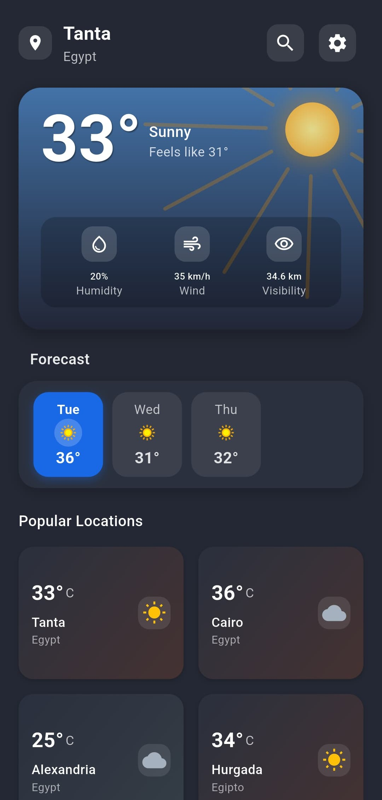
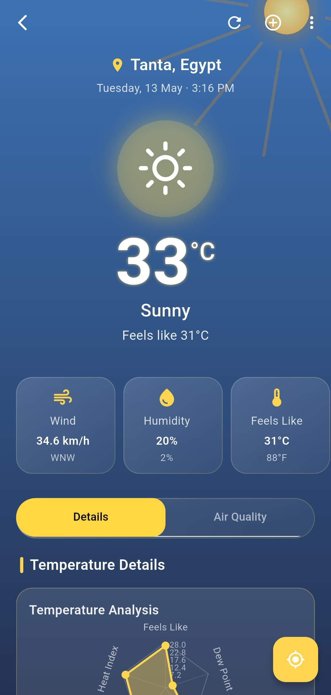

# 🌦️ Weather App

A beautiful and minimal Weather App built with **Flutter** and **BLoC** architecture.  
This app allows users to search for weather conditions by city and view real-time weather data using a clean and intuitive interface.

---

## 🚀 Features

- 🔍 Search weather by city name
- ☀️ View current weather details: temperature, condition, humidity, wind speed, etc.
- 📍 Location-based weather (optional enhancement)
- 🌓 Dynamic theme based on weather condition (e.g., sunny, rainy)
- 🧠 Built using Flutter BLoC for robust state management
- 📱 Responsive UI for all screen sizes

---

## 🛠️ Technologies Used

- **Flutter**
- **Dart**
- **Flutter BLoC**
- **Dio** (for HTTP requests)
- **Freezed / Equatable** (for immutability and equality)
- **OpenWeatherMap API** (or any weather API)

---

## 📸 Screenshots

| Home Screen                    | Weather Details                     |
|--------------------------------|-------------------------------------|
|  |  |

